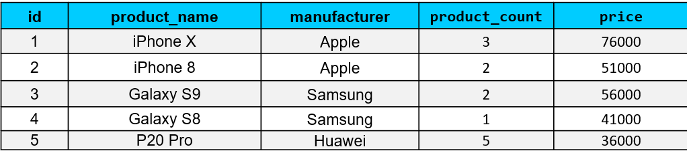
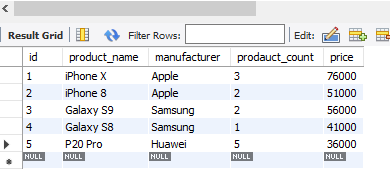
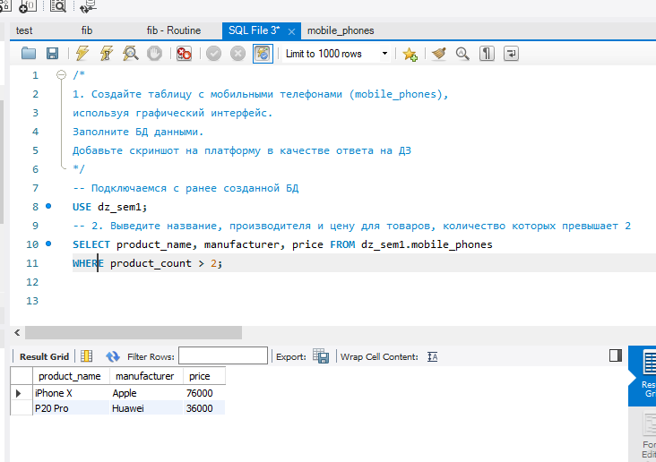
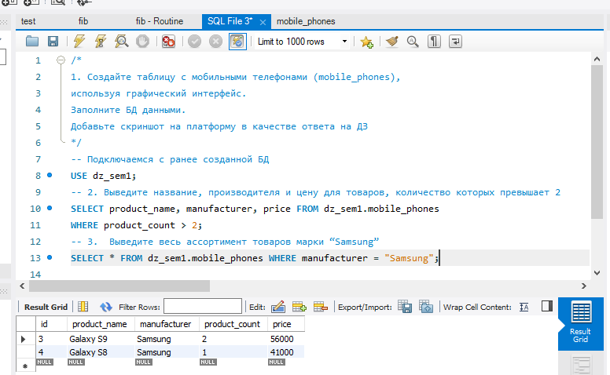
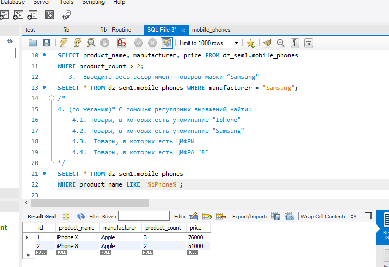
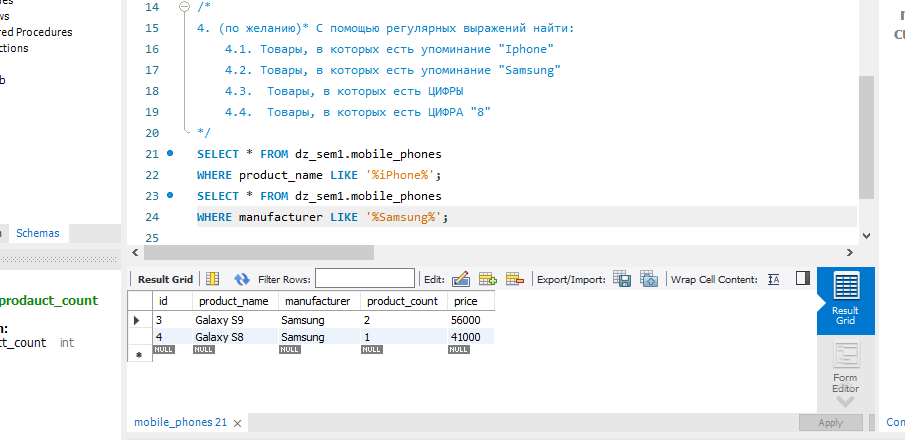
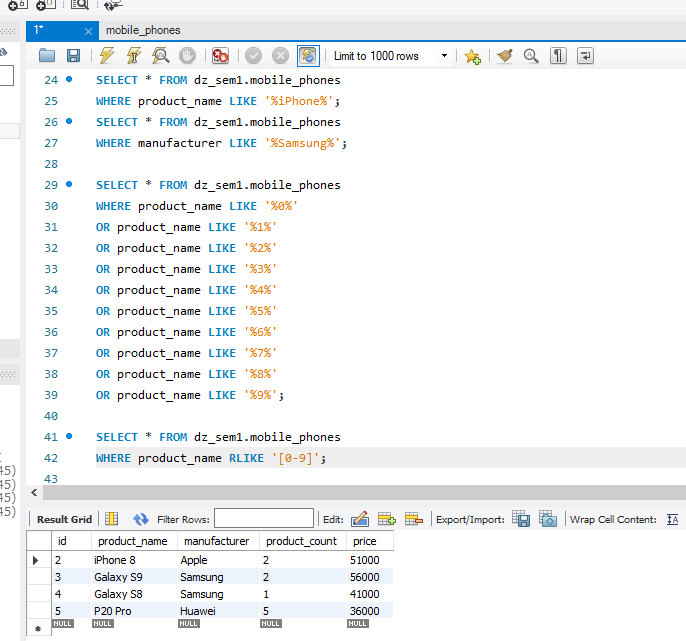
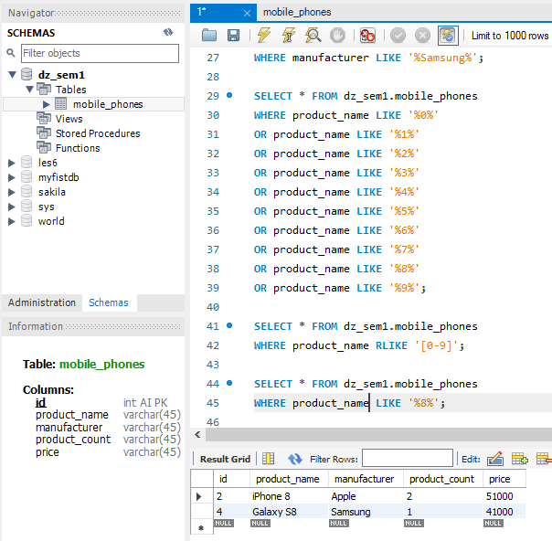

# Домашнее задание

1. Создайте таблицу с мобильными телефонами (mobile_phones), используя графический интерфейс.
-  Заполните БД данными. 
   


- Добавьте скриншот на платформу в качестве ответа на ДЗ 

2. Выведите название, производителя и цену для товаров, количество которых превышает 2
```
SELECT product_name, manufacturer, price FROM dz_sem1.mobile_phones
WHERE product_count > 2; 
```
При первом запросе программа выдала ошибку:
```
21:46:23	SELECT product_name, manufacturer, price FROM dz_sem1.mobile_phones WHERE prodauct_count > 2 LIMIT 0, 1000	Error Code: 1054. Unknown column 'prodauct_count' in 'where clause'	0.000 sec
```
которая говорит о неправильном наименовании столбца, изменим название стольбца:
```
ALTER TABLE dz_sem1.mobile_phones CHANGE prodauct_count product_count  INT;
```
Теперь запрос выводиться корректно:


3.  Выведите весь ассортимент товаров марки “Samsung”
~~~
SELECT * FROM dz_sem1.mobile_phones WHERE manufacturer = "Samsung";
~~~


4. (по желанию)* С помощью регулярных выражений найти:
	- 4.1. Товары, в которых есть упоминание "Iphone"
	- 4.2. Товары, в которых есть упоминание "Samsung"
	- 4.3.  Товары, в которых есть ЦИФРЫ
	- 4.4.  Товары, в которых есть ЦИФРА "8" 
```
SELECT * FROM dz_sem1.mobile_phones
WHERE product_name LIKE '%iPhone%';
```

~~~
SELECT * FROM dz_sem1.mobile_phones
WHERE manufacturer LIKE '%Samsung%';
~~~

```
SELECT * FROM dz_sem1.mobile_phones 
WHERE product_name RLIKE '[0-9]';
```

```
SELECT * FROM dz_sem1.mobile_phones 
WHERE product_name LIKE '%8%';
```
