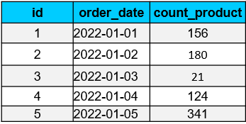
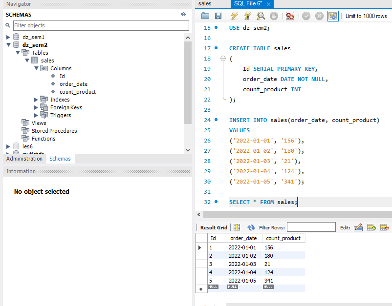
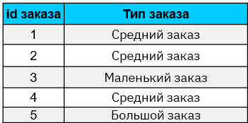
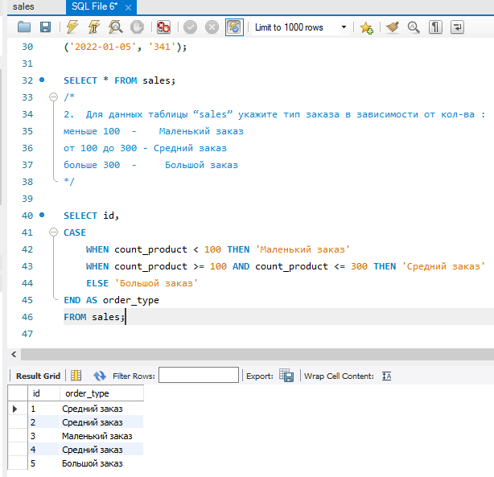
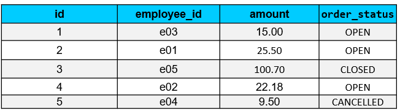
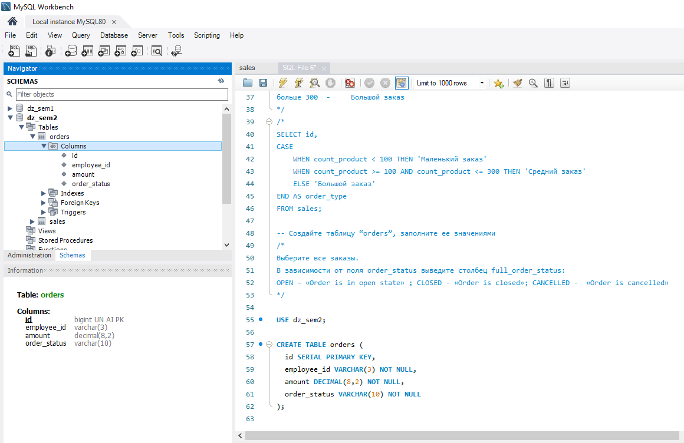
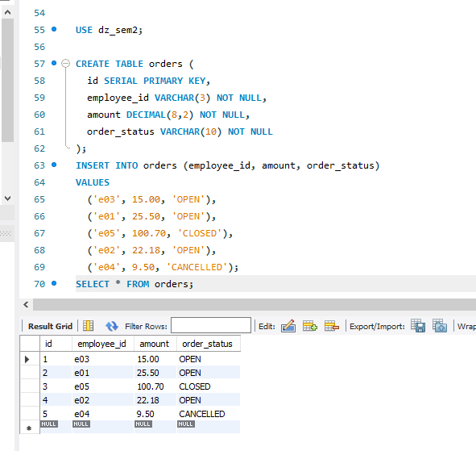

# Домашнее задание

1. Используя операторы языка SQL, создайте таблицу “sales”. 
   Заполните ее данными.
   Справа располагается рисунок к первому заданию.

- Создаём базу данных,
- Выбираем её,
- Создаём таблицу:
```
CREATE DATABASE dz_sem2;
 
USE dz_sem2;
 
CREATE TABLE sales
(
    Id SERIAL PRIMARY KEY, 
    order_date DATE NOT NULL,
    count_product INT
);
```


2.  Для данных таблицы “sales” укажите тип заказа в зависимости от кол-ва : 
меньше 100  -    Маленький заказ
от 100 до 300 - Средний заказ
больше 300  -     Большой заказ

~~~
SELECT id, 
CASE 
    WHEN count_product < 100 THEN 'Маленький заказ'
    WHEN count_product >= 100 AND count_product <= 300 THEN 'Средний заказ'
    ELSE 'Большой заказ'
END AS order_type
FROM sales;
~~~

3. Создайте таблицу “orders”, заполните ее значениями

~~~
USE dz_sem2;
 
CREATE TABLE orders (
  id SERIAL PRIMARY KEY,
  employee_id VARCHAR(3) NOT NULL,
  amount DECIMAL(8,2) NOT NULL,
  order_status VARCHAR(10) NOT NULL
);
~~~

~~~
INSERT INTO orders (employee_id, amount, order_status)
VALUES 
  ('e03', 15.00, 'OPEN'),
  ('e01', 25.50, 'OPEN'),
  ('e05', 100.70, 'CLOSED'),
  ('e02', 22.18, 'OPEN'),
  ('e04', 9.50, 'CANCELLED');
SELECT * FROM orders;
~~~

4.  Чем 0 отличается от NULL?
Напишите ответ в комментарии к домашнему заданию на платформе
~~~
0 - это конкретное число (целое или дробное), которое может быть использовано в качестве значения в столбцах числовых типов данных, таких как INTEGER, FLOAT и тп.

NULL обозначает отсутствие значения или неопределенное значение. Это может быть использовано в столбцах, которые могут содержать значения или не содержать их, таких как столбцы с датами и временем, столбцы, которые могут содержать текстовые данные, но не обязательно должны содержать их, и т.д.

Важно отметить, что операции сравнения с NULL, такие как равенство или неравенство, дают результат "неизвестно" (UNKNOWN). Таким образом, при использовании NULL в запросах SELECT, WHERE, JOIN и т.д., необходимо использовать операторы IS NULL или IS NOT NULL для корректного сравнения значений.
~~~