# Домашнее задание

====================  ТАБЛИЦА 1:  ПРОДАВЦЫ (SALESPEOPLE)  ================  

	----------------------------------------------  
		snum  |   sname   |  city        |   comm
	--------|-----------|--------------|----------
		1001  |  Peel     |  London      |    .12
		1002  |  Serres   |  San Jose    |    .13
		1004  |  Motika   |  London      |    .11
		1007  |  Rifkin   |  Barcelona   |    .15
		1003  |  Axelrod  |  New York    |    .10
	---------------------------------------------

==================  ТАБЛИЦА 2:  ЗАКАЗЧИКИ (CUSTOMERS)  ===============

	----------------------------------------------
		cnum  |  cname     | city    | rating | snum
	-------|------------|---------|--------|------
		2001  |  Hoffman   | London  |   100  | 1001
		2002  |  Giovanni  | Rome    |   200  | 1003
		2003  |  Liu       | SanJose |   200  | 1002
		2004  |  Grass     | Berlin  |   300  | 1002
		2006  |  Clemens   | London  |   100  | 1001
		2008  |  Cisneros  | SanJose |   300  | 1007
		2007  |  Pereira   | Rome    |   100  | 1004
	----------------------------------------------

==================  ТАБЛИЦА 3:   ЗАКАЗЫ (ORDERS)   ==================

	-----------------------------------------------
		onum  |    amt    |    odate    | cnum | snum
	-------|-----------|-------------|------|------
		3001  |    18.69  |  10/03/1990 | 2008 | 1007
		3003  |   767.19  |  10/03/1990 | 2001 | 1001
		3002  |  1900.10  |  10/03/1990 | 2007 | 1004
		3005  |  5160.45  |  10/03/1990 | 2003 | 1002
		3006  |  1098.16  |  10/03/1990 | 2008 | 1007
		3009  |  1713.23  |  10/04/1990 | 2002 | 1003
		3007  |    75.75  |  10/04/1990 | 2004 | 1002
		3008  |  4723.00  |  10/05/1990 | 2006 | 1001
		3010  |  1309.95  |  10/06/1990 | 2004 | 1002
		3011  |  9891.88  |  10/06/1990 | 2006 | 1001
	-----------------------------------------------

1.	 Напишите запрос, который вывел бы таблицу со столбцами в следующем порядке: city, sname, snum, comm. (к первой или второй таблице, используя SELECT)
~~~
SELECT city, sname, snum, comm
FROM SALESPEOPLE;
~~~
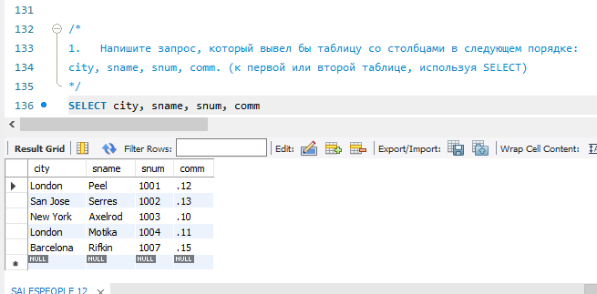

2.	 Напишите команду SELECT, которая вывела бы оценку(rating), сопровождаемую именем каждого заказчика в городе San Jose. (“заказчики”)
~~~
SELECT cname, rating FROM CUSTOMERS WHERE city='SanJose';
~~~
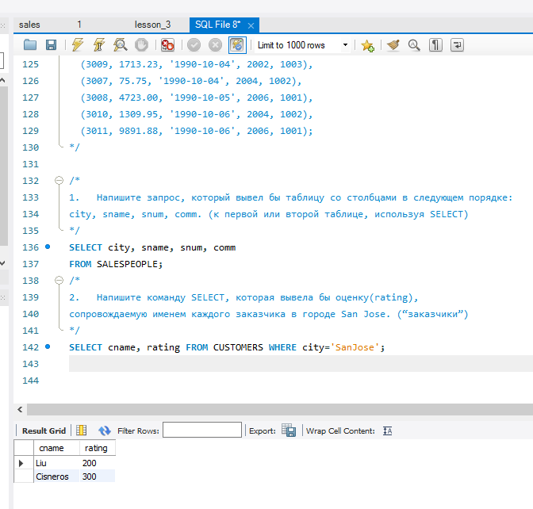
3.	 Напишите запрос, который вывел бы значения snum всех продавцов из таблицы заказов без каких бы то ни было повторений. (уникальные значения в  “snum“ “Продавцы”)
~~~
SELECT DISTINCT snum FROM ORDERS;
~~~
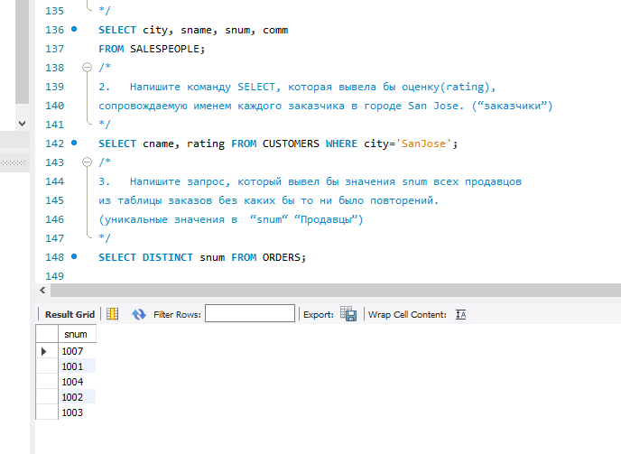
4*. 	Напишите запрос, который бы выбирал заказчиков, чьи имена начинаются с буквы G. Используется оператор "LIKE": (“заказчики”) https://dev.mysql.com/doc/refman/8.0/en/string-comparison-functions.html
~~~
SELECT * FROM CUSTOMERS WHERE cname LIKE 'G%';
~~~
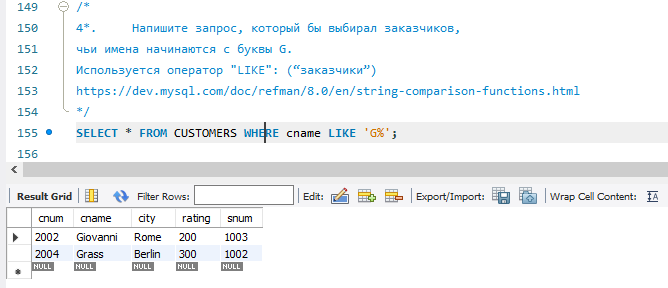
5. 	Напишите запрос, который может дать вам все заказы со значениями суммы выше чем $1,000. (“Заказы”, “amt”  - сумма)
~~~
SELECT * FROM ORDERS WHERE amt > 1000;
~~~
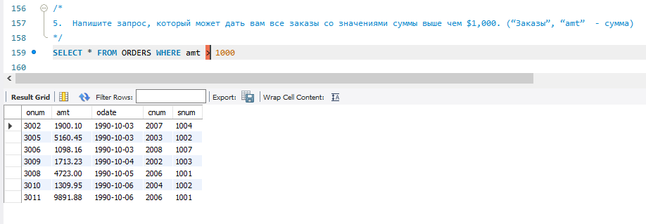
6.	Напишите запрос который выбрал бы наименьшую сумму заказа.
 (Из поля “amt” - сумма в таблице “Заказы” выбрать наименьшее значение)
~~~
SELECT MIN(amt) AS min_amt FROM ORDERS;
~~~
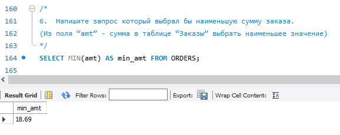
7. 	Напишите запрос к таблице “Заказчики”, который может показать всех заказчиков, у которых рейтинг больше 100 и они находятся не в Риме.
~~~
SELECT * FROM CUSTOMERS WHERE rating > 100 AND city != 'Rome';
~~~
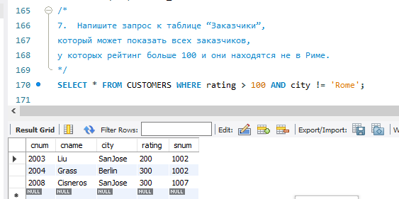

## Таблица для работы (из классной работы)
1. Отсортируйте поле “зарплата” в порядке убывания и возрастания
```
SELECT * FROM staff ORDER BY salary DESC;
SELECT * FROM staff ORDER BY salary ASC;
```
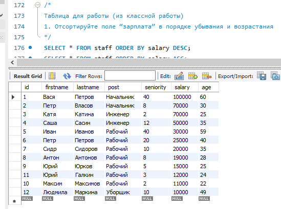
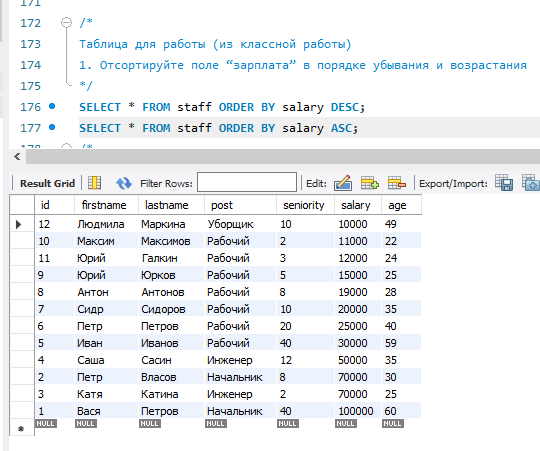
2. ** Отсортируйте по возрастанию поле “Зарплата” и выведите 5 строк с наибольшей заработной платой (возможен подзапрос)
```
SELECT * FROM staff ORDER BY salary DESC LIMIT 5;
```
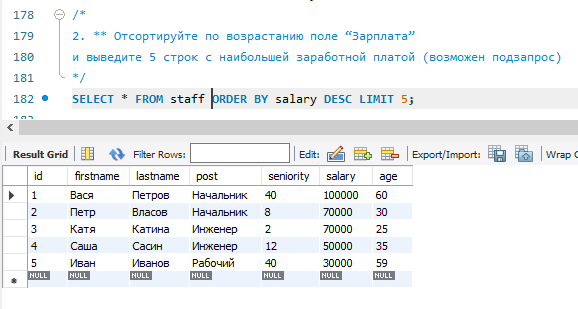
3. Выполните группировку всех сотрудников по специальности , суммарная зарплата которых превышает 100000
```
SELECT post, SUM(salary) AS total_salary
FROM staff
GROUP BY post
HAVING total_salary > 100000;
```
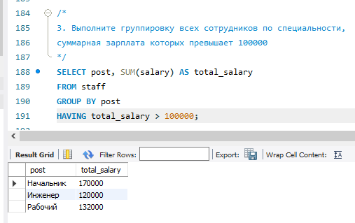