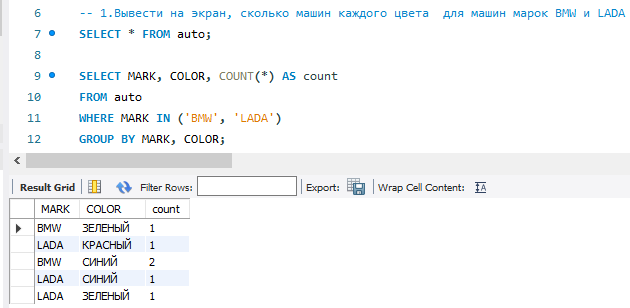
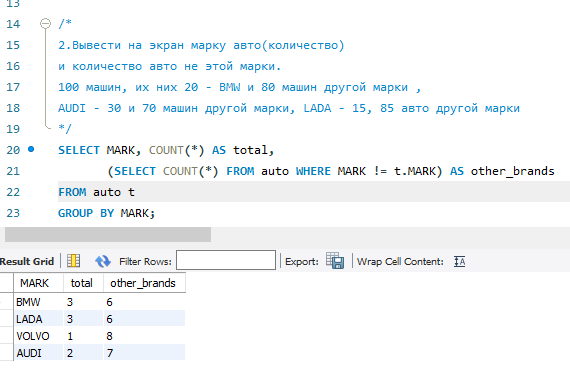
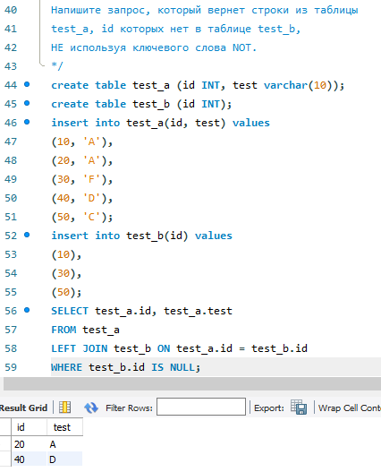

# Домашнее задание
## Табличка:
https://drive.google.com/file/d/1PQn576YVakvlWrIgIjSP9YEf5id4cqYs/view?usp=sharing

1. Вывести на экран, сколько машин каждого цвета для машин марок BMW и LADA
~~~
SELECT MARK, COLOR, COUNT(*) AS count 
FROM auto 
WHERE MARK IN ('BMW', 'LADA') 
GROUP BY MARK, COLOR;
~~~

2. Вывести на экран марку авто(количество) 
и количество авто не этой марки.
100 машин, их них 20 - BMW и 80 машин другой марки ,  
AUDI - 30 и 70 машин другой марки, LADA - 15, 85 авто другой марки
~~~
SELECT MARK, COUNT(*) AS total,
       (SELECT COUNT(*) FROM auto WHERE MARK != t.MARK) AS other_brands
FROM auto t
GROUP BY MARK;
~~~

## Задание №3.
### Даны 2 таблицы, созданные следующим образом:
```
create table test_a (id INT, test varchar(10));
create table test_b (id INT);
```
```
insert into test_a(id, test) values
(10, 'A'),
(20, 'A'),
(30, 'F'),
(40, 'D'),
(50, 'C');
```
```
insert into test_b(id) values
(10),
(30),
(50);
```
Напишите запрос, который вернет строки из таблицы 
test_a, id которых нет в таблице test_b, 
НЕ используя ключевого слова NOT.
~~~
SELECT test_a.id, test_a.test
FROM test_a
LEFT JOIN test_b ON test_a.id = test_b.id
WHERE test_b.id IS NULL;
~~~
