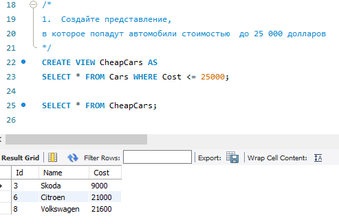
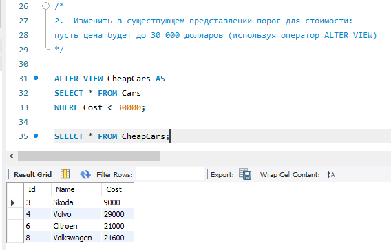
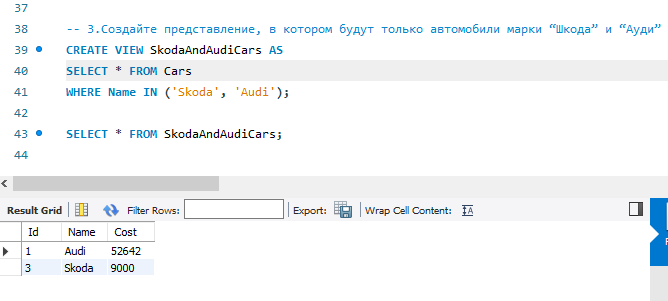
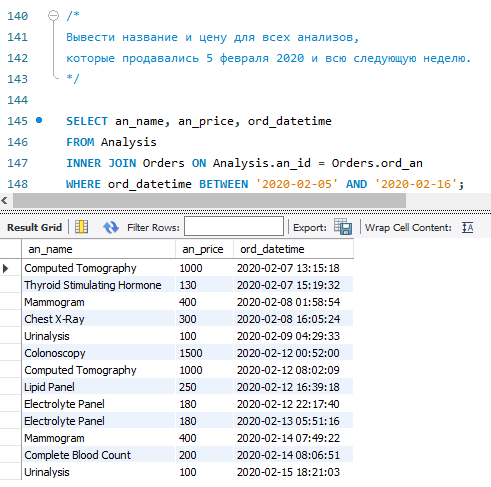
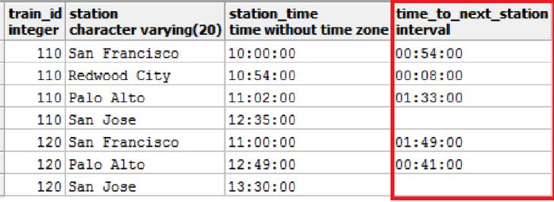
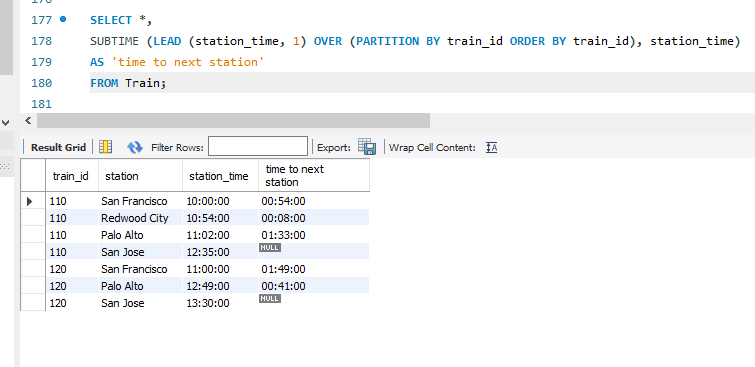

# Домашнее задание
mysql> SELECT * FROM Cars;
+----+------------+--------+
| Id | Name       | Cost   |
+----+------------+--------+
|  1 | Audi       |  52642 |
|  2 | Mercedes   |  57127 |
|  3 | Skoda      |   9000 |
|  4 | Volvo      |  29000 |
|  5 | Bentley    | 350000 |
|  6 | Citroen    |  21000 |
|  7 | Hummer     |  41400 |
|  8 | Volkswagen |  21600 |
+----+------------+--------+

1.	Создайте представление, в которое попадут автомобили стоимостью  до 25 000 долларов
~~~
CREATE VIEW CheapCars AS
SELECT * FROM Cars WHERE Cost <= 25000;

SELECT * FROM CheapCars;
~~~

2.	Изменить в существующем представлении порог для стоимости: пусть цена будет до 30 000 долларов (используя  оператор ALTER VIEW)
~~~
ALTER VIEW CheapCars AS
SELECT * FROM Cars
WHERE Cost < 30000;

SELECT * FROM CheapCars;
~~~

3. 	Создайте представление, в котором будут только автомобили марки “Шкода” и “Ауди”
~~~
CREATE VIEW SkodaAndAudiCars AS
SELECT * FROM Cars
WHERE Name IN ('Skoda', 'Audi');

SELECT * FROM SkodaAndAudiCars;
~~~

## Вывести название и цену для всех анализов, которые продавались 5 февраля 2020 и всю следующую неделю.
~~~
Есть таблица анализов Analysis:
an_id — ID анализа;
an_name — название анализа;
an_cost — себестоимость анализа;
an_price — розничная цена анализа;
an_group — группа анализов.
~~~
~~~
Есть таблица групп анализов Groups:
gr_id — ID группы;
gr_name — название группы;
gr_temp — температурный режим хранения.
~~~
~~~
Есть таблица заказов Orders:
ord_id — ID заказа;
ord_datetime — дата и время заказа;
ord_an — ID анализа.
~~~

Таблица __Orders__ сформирована с привязкой к таблице __Analysis__ по ключу an_id:
```
INSERT INTO SortedOrders (ord_datetime, ord_an)
SELECT 
    CONCAT(DATE_ADD('2020-02-01', INTERVAL FLOOR(RAND() * 15) DAY), ' ', SEC_TO_TIME(FLOOR(RAND() * 86400))),
    an_id FROM Analysis
WHERE
    DATE_ADD('2020-02-01', INTERVAL FLOOR(RAND() * 15) DAY) BETWEEN '2020-02-01' AND '2020-02-16';
```
Таблица __SortedOrders__ предназначена для формирования таблицы с последующим ранжированием по дате и заполнением таблицы __Orders__:
~~~
INSERT INTO Orders (ord_datetime, ord_an)
SELECT ord_datetime, ord_an
FROM SortedOrders
ORDER BY ord_datetime;
~~~
Для решения задачи напишем следующий скрипт:
~~~
SELECT an_name, an_price, ord_datetime
FROM Analysis
INNER JOIN Orders ON Analysis.an_id = Orders.ord_an
WHERE ord_datetime BETWEEN '2020-02-05' AND '2020-02-16';
~~~

## Добавьте новый столбец под названием «время до следующей станции». Чтобы получить это значение, мы вычитаем время станций для пар смежных станций. Мы можем вычислить это значение без использования оконной функции SQL, но это может быть очень сложно. Проще это сделать с помощью оконной функции LEAD . Эта функция сравнивает значения из одной строки со следующей строкой, чтобы получить результат. В этом случае функция сравнивает значения в столбце «время» для станции со станцией сразу после нее.

Для решения задачи создадим таблицу __Train__ и заполним её значениями, далее используя скрипт дополним таблицу:
~~~
SELECT *,
SUBTIME (LEAD (station_time, 1) OVER (PARTITION BY train_id ORDER BY train_id), station_time)
AS 'time to next station'
FROM Train;
~~~
