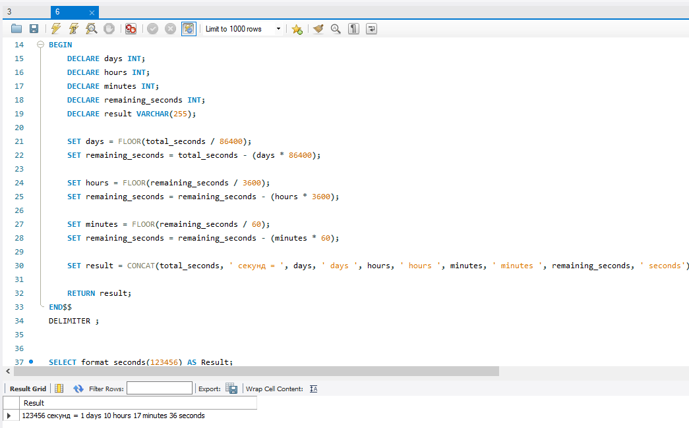
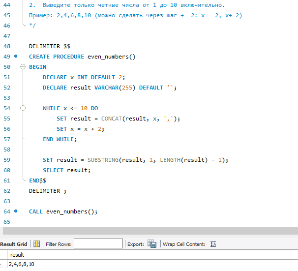

# Домашнее задание
1.	Создайте функцию, которая принимает кол-во сек и форматирует их в кол-во дней, часов, минут и секунд.
Пример: 123456 ->'1 days 10 hours 17 minutes 36 seconds '

Создаём процедуру:
~~~
DELIMITER $$
CREATE FUNCTION format_seconds(total_seconds INT)
RETURNS VARCHAR(255)
DETERMINISTIC
BEGIN
    DECLARE days INT;
    DECLARE hours INT;
    DECLARE minutes INT;
    DECLARE remaining_seconds INT;
    DECLARE result VARCHAR(255);
    
    SET days = FLOOR(total_seconds / 86400);
    SET remaining_seconds = total_seconds - (days * 86400);
    
    SET hours = FLOOR(remaining_seconds / 3600);
    SET remaining_seconds = remaining_seconds - (hours * 3600);
    
    SET minutes = FLOOR(remaining_seconds / 60);
    SET remaining_seconds = remaining_seconds - (minutes * 60);
    
    SET result = CONCAT(total_seconds, ' секунд = ', days, ' days ', hours, ' hours ', minutes, ' minutes ', remaining_seconds, ' seconds');
    
    RETURN result;
END$$
DELIMITER ;
~~~
Обращаемся к процедуре:
~~~
SELECT format_seconds(123456) AS Result;
~~~
Результат: 
~~~
Result
"123456 секунд = 1 days 10 hours 17 minutes 36 seconds"
~~~

2.	Выведите только четные числа от 1 до 10 включительно.
Пример: 2,4,6,8,10 (можно сделать через шаг +  2: х = 2, х+=2)
Создаём процедуру:
~~~
DELIMITER $$
CREATE PROCEDURE even_numbers()
BEGIN
    DECLARE x INT DEFAULT 2;
    DECLARE result VARCHAR(255) DEFAULT '';

    WHILE x <= 10 DO
        SET result = CONCAT(result, x, ',');
        SET x = x + 2;
    END WHILE;

    SET result = SUBSTRING(result, 1, LENGTH(result) - 1);
    SELECT result;
END$$
DELIMITER ;
~~~
Обращаемся к процедуре:
~~~
CALL even_numbers();
~~~
Результат:
~~~
result
"2,4,6,8,10"
~~~
